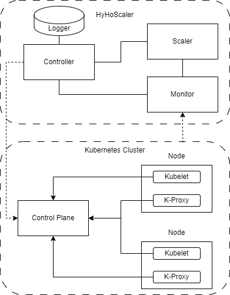

# HyHoScaler

HyHoScaler is a tool developed for horizontal scaling in Dockerized microservices, designed to enhance pod management and scaling across diverse workloads in Kubernetes (k8s) clusters.

## Architecture

We chose Python3 for the implementation, leveraging its libraries to simplify the development process. The tool is Dockerized, facilitating deployment on any k8s cluster. HyHoScaler's architecture is based on the MAPE (Monitoring, Analysis, Planning, Execution) loop and comprises four interconnected components:

<p align="center">
    
</p>

- **Monitor:** Gathers pod information and status from the control plane, collecting metrics such as total CPU and memory usage, requested CPU and memory, and resource limits.

- **Scaler:** Implements logic for auto-scaling decisions, analyzing monitored data to determine the optimal number of replicas for each deployment in the cluster.

- **Controller:** Manages the allocation of predicted replicas to each deployment, communicating with the control plane node in the k8s cluster.

- **Logger:** Records scaling decisions and monitored events, providing valuable information for future proactive-based systems.

## Testing Environment

To evaluate HyHoScaler and compare it with k8s HPA, we set up a testing environment on Microsoft Azure:

- Three Linux VMs hosted on a Windows machine.
- Online Boutique application by Google running on a k8s cluster.
- Control plane and two worker nodes for pod management.

## Experiment Overview

We conducted three controlled trials with comparable workloads, each lasting 10 minutes. The query time for monitoring was set to 30 seconds, aligning with the default k8s HPA algorithm for fair comparison.

1. **Kubernetes HPA:** Load test using default HPA, allowing a maximum of 800 users with a target CPU utilization of 50%.

2. **HyHoScaler<sub>CPU</sub>:** HyHoScaler focusing on CPU usage. Resulted in a 12.5% improvement in the 95th percentile of response time with no system failures.

3. **HyHoScaler<sub>CPU + MEM</sub>:** Comprehensive evaluation with both CPU and memory monitoring. Achieved a significant 37.5% reduction in the 95th percentile of response time compared to default k8s HPA.


<p align="center">
  <figure style="position:relative; text-align:center">
    
    <figcaption style="position:absolute; top:0; left:0; width:100%;">Autoscaling with k8s HPA</figcaption>
  </figure>
  
  <figure style="position:relative; text-align:center; margin: 0 20px">
    
    <figcaption style="position:absolute; top:0; left:0; width:100%;">Autoscaling with HyHoScaler only monitoring CPU usage</figcaption>
  </figure>
  
  <figure style="position:relative; text-align:center">
    
    <figcaption style="position:absolute; top:0; left:0; width:100%;">Autoscaling with HyHoScaler monitoring CPU and memory usage</figcaption>
  </figure>
</p>

## Conclusion

Results show that incorporating memory as a scaling metric enhances system performance. Moreover, the implementation of a simple rule-based auto-scaling method in HyHoScaler outperforms the default k8s HPA.

## Installation
```
git clone https://github.com/2arian3/HyHoScaler.git
cd HyHoScaler/

docker build . -t HyHoScaler:1.0
docker run --name autoscaler HyHoScaler:1.0
```

## Load Test
We used a modified version of [Locust](https://github.com/pacslab/pacs_locust). You can run the load test using the following commands:

```
git clone https://github.com/2arian3/HyHoScaler.git
cd HyHoScaler/

pip3 install virtualenv

virtualenv venv
source /venv/bin/activate

pip3 install -r requirements.txt

python3 start_load_test.py
```

The results of the exection will be saved in ```results/``` directory. 

---

Feel free to contribute, report issues, or suggest improvements!
